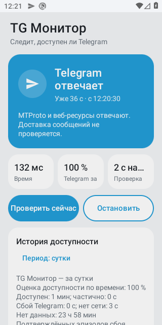
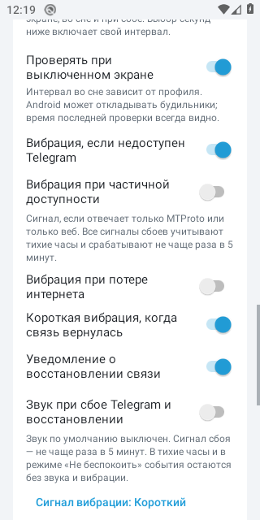

# TG Монитор 1.11

[](https://github.com/qlolp/TgWatch/actions/workflows/build-apk.yml)
[](https://github.com/qlolp/TgWatch/releases/latest)
[](LICENSE)

Android-приложение для локального наблюдения за доступностью Telegram. Android 8.0+.
Аккаунт Telegram, номер телефона и доступ к переписке не нужны. Приложение не отправляет сообщения.

## Что показывает

1.11 объединяет возможности опубликованной [1.10.47](https://github.com/qlolp/TgWatch/releases/tag/v1.10.47)
и локальной доработки: независимые уведомления/звук, минутные тихие часы, последний OK,
CSV-импорт и более строгую диагностику. [Резервная копия](docs/backup.md) имеет единый формат
TGWB v2 и читает обе прежние разновидности 1.10. [Ключ подписи](docs/signing-backup.md)
сохраняется существующий; CI предусматривает OSV и Trivy. Проверки и публикация новой
1.11 фиксируются отдельно, ссылка latest может пока вести на 1.10.47.

- **Telegram отвечает:** получены ответ MTProto с совпавшим случайным nonce и HTTP-ответ одного из веб-ресурсов Telegram.
- **Частично доступен:** ответил только MTProto или только веб-ресурс.
- **Telegram недоступен:** контрольный сайт ответил, а Telegram не подтвердил доступность.
- **Нет сети:** отсутствует активное подключение либо Wi-Fi требует входа.
- **Доступность не определена:** ни один адрес не подтвердил связь. Таймаут контрольных сайтов не доказывает отсутствие интернета.
- **Мониторинг задерживается:** результат устарел; открытый процесс сам по себе не считается работающим мониторингом.

MTProto-проверка — только начальный обмен `req_pq_multi` / `resPQ`, без создания аккаунтной сессии.
Принимается только полный структурно корректный `resPQ`: nonce, заголовок, server message id,
TL-поле `pq`, выравнивание и вектор fingerprints проверяются в ограниченной рамке до 4096 байт.
Она подтверждает ответ протокола, **не доставку сообщений и не криптографическую аутентификацию сервера**.
Прокси, заданный внутри самого Telegram, не используется. Системный VPN учитывается как часть активной сети.

В диагностике видны Wi-Fi / мобильная сеть / VPN, время проверки, каждый проверенный адрес,
HTTP-код, DNS/TLS/таймаут и время ответа. Все запросы привязаны к выбранной Android Network;
при её смене результат отбрасывается как неопределённый и запускается новая проверка.

## Частота и батарея

| Профиль | Экран включён | Экран выключен | Подтверждённый сбой |
|---|---:|---:|---:|
| Экономичный | 60 с | 300 с | 60 с |
| Обычный | 30 с | 120 с | 30 с |
| Частый | 15 с | 60 с | 10 с |

Можно выбрать свой интервал. Интервал — пауза **после завершения** предыдущей проверки.
Проверки Telegram ограничены общим сроком 6 с; при необходимости контрольные сайты получают ещё 6 с.
Они проверяются параллельно. Очередь сетевых задач не растёт без ограничения.
Повторный запрос к зависшему адресу не создаётся, пока предыдущая операция реально не завершилась.

Без активной сети запросы к серверам не выполняются. При длительном отсутствии сети паузы
растут до 30 / 60 / 120 / 300 секунд, не опускаясь ниже интервала выбранного профиля.
Системное событие появления или смены сети сразу сбрасывает ожидание. Подтверждённый
сбой Telegram при работающей сети проверяется с обычной частотой профиля.

Разрешите уведомления и работу в фоне. Точные будильники помогают будить приложение,
но Android Doze и ограничения производителя могут откладывать проверки. Приложение
не обещает жёсткого интервала во сне и показывает возраст результата.

Уведомления о полном сбое TG_DOWN, PARTIAL и восстановлении настраиваются независимо.
PARTIAL по умолчанию выключен; полный сбой и восстановление сохраняют прежние настройки.
Звук каждого события также независим и по умолчанию выключен. Для выбора звука и важности
используются отдельные системные каналы Android; настройки каналов на другом устройстве
не переносятся. Изменение одной опции не включает другие события.

Вибрация при подтверждённом сбое Telegram — не чаще раза в пять минут. Отдельные опции
вибрации PARTIAL, потери сети и восстановления сохраняются. Тревоги учитывают тихие часы
и системный режим «Не беспокоить»; наблюдения и история продолжаются без звука и вибрации.
Тихие часы задаются с точностью до минуты в локальном часовом поясе, например 23:15–08:45.
Начало входит в интервал, конец не входит; одинаковые границы отключают тихий интервал.
Старые настройки по часам сохраняются как HH:00.
Плитка быстрых настроек и виджет показывают те же состояния, что основной экран.
Виджет отдельно показывает время последнего опубликованного OK: PARTIAL и ошибки его
не заменяют, перезапуск сохраняет его. При переводе часов назад виджет отмечает смену часов,
а прошлый успех не объявляется свежей проверкой.

При восстановлении приходит отдельное уведомление «Telegram снова доступен» с длительностью
непрерывно наблюдаемого сбоя. PARTIAL между полным сбоем и OK не теряет это событие;
восстановление после одного PARTIAL учитывается, если включена его опция. Пробелы наблюдений
не объявляются временем отключения. Уведомление можно выключить в дополнительных настройках.

При включении звука используется системный звук уведомлений с учётом выбора канала;
тихие часы и DND подавляют звук и вибрацию.
Доступны тройной, короткий и длинный варианты вибрации; тройной остаётся исходным вариантом.

## История и CSV

История хранится локально семь дней. Выберите сутки или неделю; для суток график показывает последний час,
для недели — семь дней. Цвета столбиков описывают результаты проверок, процент в сводке считается по времени.

Доступность = время OK / (время OK + частичная доступность + подтверждённый сбой).
Время без сети и без наблюдений исключается из знаменателя и показывается отдельно.
После результата состояние оценивается не дольше ожидаемого интервала + 15 с;
продолжительные пробелы не склеиваются в непрерывный сбой. Это оценка по наблюдениям, не точное измерение каждой секунды.

Кнопка **«Сохранить CSV»** открывает системный выбор файла. CSV содержит интервалы в UTC,
статус, длительность и время ответа; отсутствующие наблюдения явно обозначены `UNKNOWN`.
CSV можно импортировать через системный выбор файла с предварительным просмотром и
подтверждением замены истории. Поддерживаются текущие семь колонок и старые пять колонок.
Все строки `UNKNOWN` пропускаются: формат не различает реальные неопределённые проверки
и сгенерированные пробелы. Эти промежутки остаются временем без наблюдений, но не увеличивают
число проверок. Если после пропуска не остаётся записей текущей временной эпохи, импорт
даёт пустую историю, чтобы старые эпохи не стали текущими. CSV переносит только историю;
для настроек и журнала используйте резервную копию. CSV остаётся обычным незашифрованным файлом.
Сводкой и журналом можно поделиться вручную.

Сводка также показывает число отдельных подтверждённых эпизодов сбоя Telegram,
число потерь сети и длительность последнего или текущего наблюдаемого сбоя.
Повторные неудачные проверки в непрерывном эпизоде не увеличивают счётчик;
пробел в данных разрывает эпизод. Значения относятся к выбранным суткам или неделе.
Добавлены отдельные числа проверок OK / TG_DOWN / PARTIAL / NO_NETWORK / UNKNOWN и MTTR —
среднее время восстановления только полностью наблюдённых эпизодов. В выбранном окне
подтверждённый эпизод TG_DOWN должен быть полностью наблюдён и завершиться свежим OK;
PARTIAL может продолжать такой эпизод. Пробел, UNKNOWN, NO_NETWORK, смена временной эпохи и обрезанные границы окна
не дают завершённого эпизода. Если подходящих эпизодов нет, MTTR не показывается.

При переводе часов назад начинается новая временная эпоха. Старые наблюдения сохраняются,
но исключаются из текущей сводки и графика, чтобы не переиспользовать прошлые результаты.
CSV сохраняет их с `clock_epoch` и `in_current_statistics=false`, даже если их даты стали будущими.
Срок хранения — семь дней; дополнительный предел 65 000 наблюдений ограничивает архив при неверных часах.

Данные хранятся в device-protected хранилище и доступны до первого ввода PIN после перезагрузки.
История старых версий переносится после разблокировки; исходный файл сохраняется.
Старые минутные записи импортируются как приближённые минутные оценки.
Файл дописывается небольшими записями; периодическая компактизация заменяет его атомарно.
Синхронизация append выполняется при смене статуса и при очередной записи, если с прошлого
сохранения прошло не менее 60 секунд; остановка и замена истории выполняют отдельное сохранение. Последние ещё не
синхронизированные записи могут быть потеряны при отключении питания.

## Резервная копия и восстановление

В дополнительных настройках можно сохранить зашифрованную резервную копию и восстановить её
на другой установке через системный выбор файла, без разрешения на доступ ко всему хранилищу.
Копия включает пользовательские настройки, наблюдения и журнал событий. Пароль вводится
с подтверждением при экспорте, содержит 12–256 символов и не сохраняется приложением.
Используется AES-256-GCM с ключом из пароля; без пароля восстановить файл нельзя.
Новые копии — TGWB v2 с ограниченным JSON snapshot. Принимаются опубликованный бинарный
TGWB v1 и прежний локальный TGWBKUP1; экспорт создаёт только v2. [Форматы и ограничения](docs/backup.md).

Перед применением показываются дата и объём копии, затем требуется подтверждение
**замены текущих настроек, истории и журнала**. Это не объединение архивов. После восстановления
мониторинг остаётся выключенным; запустите его вручную для новой проверки. Старое состояние
сети и последний OK не переносятся, системные разрешения нужно предоставить на новом устройстве.
Неверный пароль и повреждённый файл отклоняются до изменения данных и остановки мониторинга.

Прерванная после подтверждения замена завершается из локального журнала транзакции
при следующем запуске процесса; пока она не завершена, мониторинг не должен публиковать
новый статус. Обычный семидневный срок хранения действует и после переноса. Пределы копии:
8 МиБ расшифрованных данных, 65 000 наблюдений и 150 строк журнала по 4096 символов.
CSV-импорт заменяет историю, сохраняя пользовательские настройки и журнал, и также
оставляет мониторинг выключенным. Текущее диагностическое состояние и последний OK сбрасываются.

## Установка и выпуск

[Последний опубликованный APK](https://github.com/qlolp/TgWatch/releases/latest/download/TgWatch.apk).
Базовый опубликованный выпуск для обновления — `v1.10.47`; новая 1.11 использует тот же
постоянный signing identity. Перед публикацией предусмотрены проверка сертификата и
обновление настоящего APK 1.10.47 без удаления данных. Локальное обновление с общей
development-подписью проверяет миграцию, но не подтверждает production signing continuity.
APK из артефакта `TgWatch-debug-test-only` предназначен для тестирования.

Обычные push и PR запускают проверки. Публикация — отдельный ручной запуск
**Actions → Build APK → Run workflow**, ветка `main`, `publish=true`.
Ей нужны JVM/helper tests, lint, сборки, Android-проверки, успешные OSV и Trivy audits
этого запуска и существующий production-ключ. Публикации выполняются последовательно
и не отменяются новым push; автоматические проверки имеют отдельные группы отмены.

Тег выпуска — `v<versionName>.<run_number>`, `versionCode = run_number + 100` с проверкой
положительного числа и диапазона Android. Локальная 1.11 имеет `versionCode=12`.
Более старый запуск не заменяет новый `latest`. Повтор существующего выпуска допустим
только с тем же commit и идентичными assets; draft, неполные данные, изменённые файлы
и существующий тег на другом commit останавливают публикацию. С APK предусмотрены
SHA-256, CycloneDX runtime SBOM и отчёты аудита. Недоступный audit не считается чистым.

Скрипт подписи принимает **только существующий** PKCS12 и пароль из macOS login Keychain
либо скрытого ввода на доверенном Mac. Он проверяет приватный alias `tgwatch` и ожидаемый
сертификат, не генерирует ключ и не создаёт новый открытый парольный файл. Для обычного
выпуска ничего заново инициализировать не нужно. Перенос прежнего парольного файла
в Keychain удаляет его только после независимой проверки восстановления. Команды и
ограничения: [защита signing backup](docs/signing-backup.md).

Старая 1.6 с утраченной debug-подписью не обновится APK с другим ключом. Удаление приложения
удаляет приватные данные. Перенос возможен только из установки, в которой уже доступен
экспорт резервной копии или CSV; существование импорта в 1.11 не добавляет экспорт
в старый установленный APK. Для бесшовного обновления нужен исходный ключ.

## Разработка и проверки

```bash
bash ./gradlew testDebugUnitTest lintDebug assembleDebug assembleRelease
bash scripts/android-smoke.sh  # на отдельном тестовом эмуляторе; меняет сеть и PIN, перезагружает его
```

`assembleRelease` без переменных подписи создаёт unsigned APK только для проверки сборки.
Для локальной подписанной сборки задайте `TGWATCH_KEYSTORE_PATH`, `TGWATCH_KEYSTORE_PASSWORD`,
`TGWATCH_KEY_ALIAS`, `TGWATCH_KEY_PASSWORD`. Не помещайте секреты в командную строку или git.

CI запускается для push в main и для pull request (без дублирования прогонов ветки). Проверяются временная статистика, пробелы,
параллельные таймауты, полная структура MTProto, backup/CSV и их пределы, MTTR,
минутные тихие часы, последний OK, атомарное хранилище, профили и Android Lint.
Сценарии для эмуляторов API 29 и 35 собирают старую 1.6 и текущую версию с одной тестовой подписью и проверяют
обновление и перенос старой истории, свежие записи после смены сети/Doze и locked boot.
Сценарии проверяют логи до и после перезагрузки. Описание сценария не является отчётом
об успешном прогоне 1.11. Эта проверка не доказывает совместимость с утерянным
debug-ключом ранее опубликованного APK.

Основные компоненты: `NetworkProbe.kt`, `MtProto.kt`, `Timeline.kt`, `HistoryStorage.kt`,
`History.kt`, `PortableBackupCodec.kt`, `BackupCrypto.kt`, `BackupCodec.kt`, `CsvImport.kt`, `RestoreTransaction.kt`,
`PowerProfile.kt`, `MonitorService.kt`. [Карта архитектуры](docs/superpowers/architecture.md).
План и решения: `docs/superpowers/`.

Протокол и адреса: [MTProto](https://core.telegram.org/mtproto/samples-auth_key),
[встроенные DC Telegram Desktop](https://github.com/telegramdesktop/tdesktop/blob/dev/Telegram/SourceFiles/mtproto/mtproto_dc_options.cpp).

## Дополнительные настройки и адреса DC

Профиль батареи доступен на основном экране. Ручные интервалы, вибрация, тихие часы,
настройки фоновой работы и журнал находятся под кнопкой «Дополнительные настройки».
Диагностика подключения раскрывается отдельной кнопкой.

Каталог `MtProtoEndpoints.kt` содержит пять официальных production-адресов DC,
сверенных с Telegram Desktop 10 октября 2026 года. Они проверяются параллельно с тремя
веб-ресурсами в существующем шестисекундном бюджете и пуле из восьми потоков.
Это резервирование адресов, а не автоматическое получение актуальной конфигурации Telegram:
каталог нужно пересматривать при выпусках. Домены веб-клиента не подставляются в TCP-транспорт.

`scripts/signed-upgrade-smoke.sh` запускается перед публикацией на отдельном эмуляторе:
устанавливает настоящий APK `v1.10.47`, обновляет его без удаления и проверяет сохранённые
наблюдения, настройки и появление новых записей. Закрытый ключ при этом остаётся в Secrets.

Инструкция для разработчиков: [CONTRIBUTING](CONTRIBUTING.md). Выпуски: [CHANGELOG](CHANGELOG.md).
Лицензия: [MIT](LICENSE).

## Скриншоты

Снимки предыдущего интерфейса из CI на эмуляторе Android 15. Они пока не иллюстрируют
новые элементы 1.11 для переноса данных и минутных тихих часов.

| Основной экран | Дополнительные настройки |
|---|---|
|  |  |
