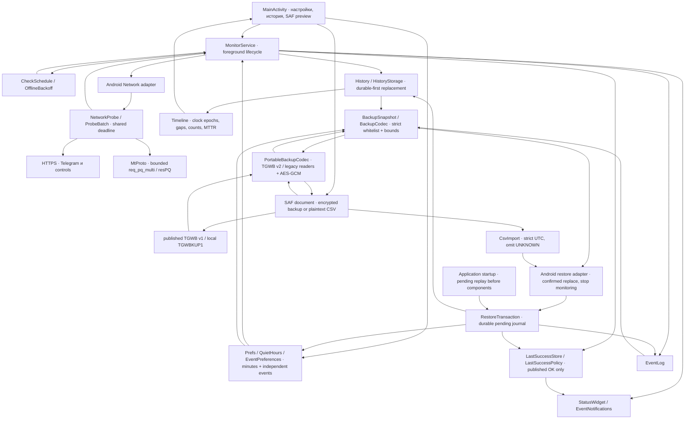

# Архитектура TgWatch 1.11

Android 8.0+; native Views и существующая foreground-служба. Чистые Kotlin policies и codecs отделены от Android-хранилища, Network/SAF и UI. Карта показывает потоки данных; наличие пути не заменяет отчёт о его проверке.

## Границы поведения

- MTProto — unauthenticated greeting без аккаунта и RPC. Парсер проверяет весь TL resPQ и canonical abridged frame ≤4096 bytes. Ответ с nonce подтверждает протокол, но не серверную аутентичность или доставку сообщения. NetworkProbe сохраняет общий бюджет Telegram 6 с и дополнительный бюджет controls при необходимости; отмена закрывает транспорт.
- История описывает ограниченные интервалы наблюдений. Gaps остаются UNKNOWN time; clock rollback создаёт новую эпоху. Счётчики проверок считаются по наблюдениям; MTTR — для полностью наблюдённого TG_DOWN, закрытого свежим OK в текущем окне. PARTIAL может продолжать эпизод; gaps, UNKNOWN/NO_NETWORK и clipping его исключают.
- Backup переносит только разрешённые настройки, историю и журнал. Диагностический last OK, состояние службы, cooldowns и OS permissions исключены. Новый экспорт TGWB v2 содержит strict JSON, импорт читает оба старых формата 1.10; пароль экспорта 12–256 символов. Криптография аутентифицирует весь header/ciphertext; codec проверяет строгие типы/числа/лимиты до применения. Расшифрование/экспорт выполняются вне UI thread.
- Restore после preview/подтверждения заменяет данные и оставляет monitoring остановленным. Оба старых private journal formats читаются при обновлении. Pending journal replay идемпотентно завершает прерванную замену до работы компонентов; это несколько durable записей с восстановлением после сбоя, а не обещание одной общей файловой транзакции Android. Неверный пароль и malformed input не создают transaction и не останавливают действующий monitoring.
- CSV — plaintext history interchange. UNKNOWN rows опускаются, поскольку экспорт не отличает реальные UNKNOWN checks от generated gaps. При отсутствии сохранённых строк текущей эпохи возвращается пустая история. Семидневное хранение сохраняется.
- Quiet hours — local minute-of-day с legacy hour fallback; last success — сохранённый опубликованный OK, независимый от свежести текущего состояния.

## Выпуск

```mermaid
flowchart LR
    INPUT["main push / PR / manual workflow"] --> CHECKS["build + unit + lint + Android scenarios"]
    CHECKS --> INVENTORY["resolved releaseRuntimeClasspath"]
    INVENTORY --> BOM["CycloneDX 1.6 · purl / version / SHA-256"]
    BOM --> SCAN["Trivy HIGH / CRITICAL gate"]
    CHECKS --> OSV["resolved runtime + tests · OSV audit"]
    OSV --> ARTIFACT
    SCAN --> ARTIFACT["this run's SBOM + Trivy + OSV evidence"]
    ARTIFACT --> MANUAL["main + manual publish=true"]
    MANUAL --> SIGN["existing signing identity + v1.10.47 upgrade gate"]
    SIGN --> POLICY["serialized release-policy · immutable tag/assets"]
    POLICY --> RELEASE["APK + hash + SBOM + Trivy / OSV reports"]
    POLICY --> LATEST["latest only for higher versionCode"]
```

Оба audits должны завершиться успешно; недоступность не превращается в чистый результат. Trivy проверяет HIGH/CRITICAL с runtime package coverage, OSV — точные runtime/test Maven versions и неотозванные записи. SBOM отражает разрешённые JAR/AAR runtime dependencies, а не Android platform или test libraries. Публикации отделены от отменяемых checks; signing helper принимает только существующий private key с expected-certificate проверкой и не генерирует новый. Production continuity проверяется в CI, development-key upgrade этого не доказывает.

Спецификация: [unified 1.11](specs/2026-10-10-unified-1.11-design.md). План: [implementation](plans/2026-10-10-unified-1.11.md). Команды и ограничения проверок: [CONTRIBUTING](../../CONTRIBUTING.md).
