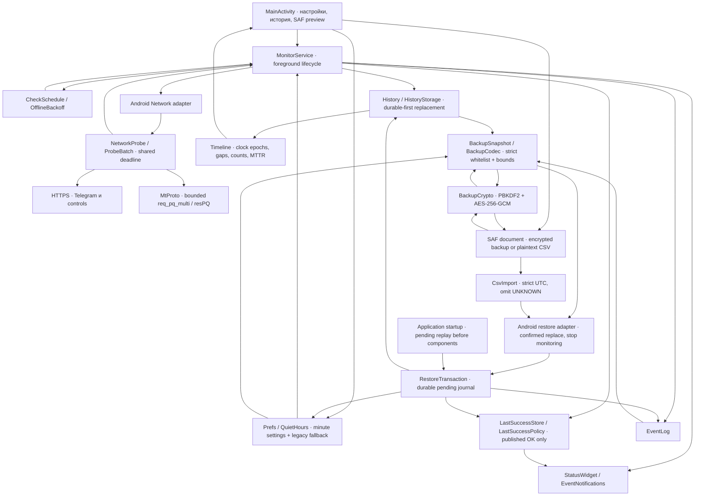
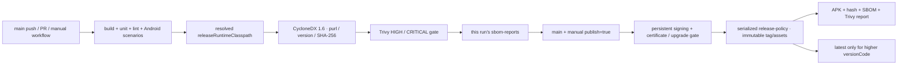

# Архитектура TgWatch 1.10

Android 8.0+; native Views и существующая foreground-служба. Чистые Kotlin policies и codecs отделены от Android-хранилища, Network/SAF и UI. Карта показывает потоки данных; наличие пути не заменяет отчёт о его проверке.

## Границы поведения

- MTProto — unauthenticated greeting без аккаунта и RPC. Парсер проверяет весь TL resPQ и canonical abridged frame ≤4096 bytes. Ответ с nonce подтверждает протокол, но не серверную аутентичность или доставку сообщения. NetworkProbe сохраняет общий бюджет Telegram 6 с и дополнительный бюджет controls при необходимости; отмена закрывает транспорт.
- История описывает ограниченные интервалы наблюдений. Gaps остаются UNKNOWN time; clock rollback создаёт новую эпоху. Счётчики проверок считаются по наблюдениям, MTTR — только для OK→TG_DOWN→OK в текущем окне. PARTIAL может продолжать эпизод; gaps, UNKNOWN/NO_NETWORK и clipping его исключают.
- Backup переносит только разрешённые настройки, историю и журнал. Диагностический last OK, состояние службы, cooldowns и OS permissions исключены. Криптография аутентифицирует весь header/ciphertext; codec проверяет строгие типы/числа/лимиты до применения. Расшифрование/экспорт выполняются вне UI thread.
- Restore после preview/подтверждения заменяет данные и оставляет monitoring остановленным. Pending journal replay идемпотентно завершает прерванную замену до работы компонентов; это несколько durable записей с восстановлением после сбоя, а не обещание одной общей файловой транзакции Android. Неверный пароль и malformed input не создают transaction и не останавливают действующий monitoring.
- CSV — plaintext history interchange. UNKNOWN rows опускаются, поскольку экспорт не отличает реальные UNKNOWN checks от generated gaps. При отсутствии сохранённых строк текущей эпохи возвращается пустая история. Семидневное хранение сохраняется.
- Quiet hours — local minute-of-day с legacy hour fallback; last success — сохранённый опубликованный OK, независимый от свежести текущего состояния.

## Выпуск

Состояние scan должно быть `passed`, недоступность не превращается в чистый результат. SBOM отражает разрешённые JAR/AAR runtime dependencies, а не Android platform или test libraries. Публикации отделены от отменяемых checks; `restore` signing использует существующий ключ, `init` требует явного намерения создать новый.

Спецификация: [portability and release](specs/2026-10-10-portability-and-release-design.md). План: [implementation](plans/2026-10-10-portability-and-release.md). Команды и ограничения проверок: [CONTRIBUTING](../../CONTRIBUTING.md).
